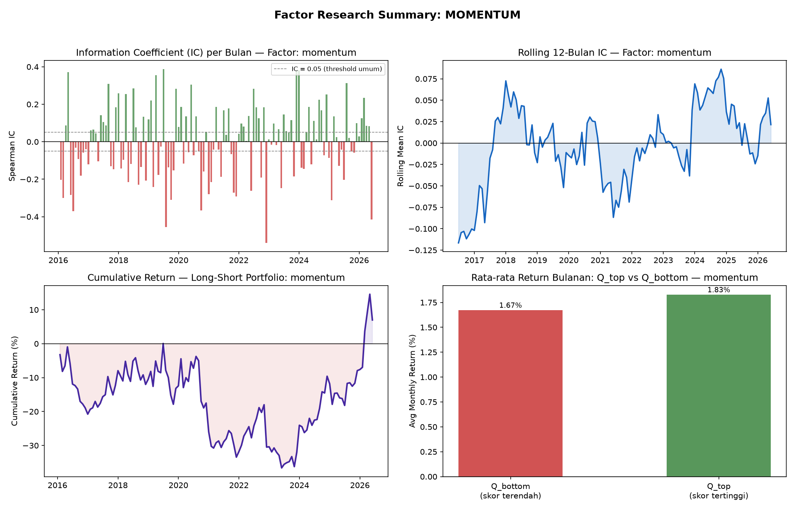
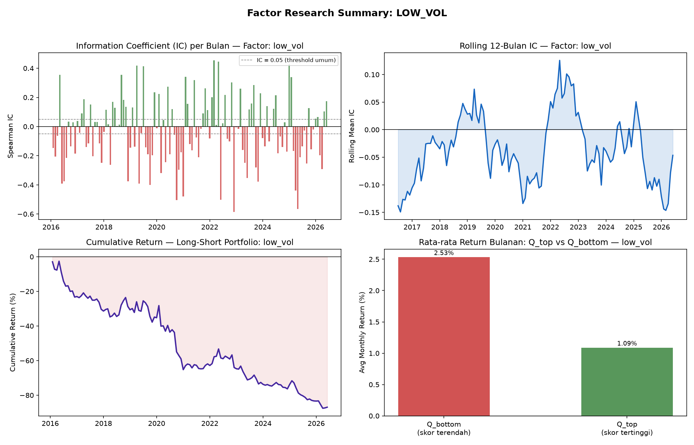
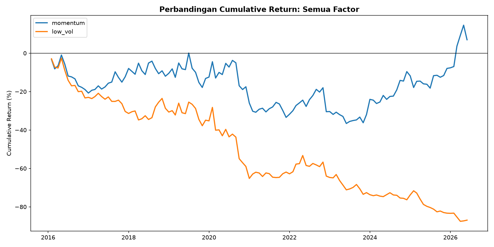

# Momentum and Low-Volatility Factor Research in the S&P 500 (2015–2026)

*A cross-sectional equity factor study: construction, validation, and robustness testing of two classic anomalies over an 11.5-year sample.*

---

## Executive Summary

This project builds and rigorously tests two well-known equity factors — **12-month momentum** and **low-volatility** — on the full S&P 500 universe (503 constituents) from January 2015 through July 2026. The goal was not simply to backtest a strategy, but to apply the statistical discipline of factor research: cross-sectional ranking, Information Coefficient (IC) analysis, sub-period robustness checks, and transaction cost estimation.

**Headline findings:**

- **Momentum shows no reliable predictive power** in this sample. The mean Information Coefficient is essentially zero (IC = -0.003, t-stat = 0.34), and this conclusion strengthens — rather than weakens — as the universe grows from a small subset to the full 503 stocks, which is a strong signal that smaller-sample "profits" were driven by idiosyncratic noise rather than a genuine effect.
- **Low-volatility shows a statistically significant *reversed* anomaly.** Contrary to the traditional low-volatility anomaly (which predicts low-vol stocks *outperform*), high-volatility stocks in this sample **outperformed** low-volatility stocks by a wide and statistically significant margin (IC = -0.033, t-stat = -2.79), consistent in direction across all three market regimes tested, and strongest during the 2023–2026 AI-driven rally (t-stat = -2.49).
- After accounting for realistic transaction costs, momentum's already-marginal gross return is reduced by roughly a third, while low-volatility's negative return is barely affected (turnover costs are a rounding error next to the size of the loss).

The most interesting part of this project was methodological: an early version of the pipeline used a fixed 50-stock subset for fast iteration, which — because the ticker list is alphabetically sorted — happened to oversample mega-cap technology names (AAPL, ADBE, AMD, AMZN, ANET, GOOGL). This produced a *dramatically* inflated and misleading picture of both factors. Catching, diagnosing, and correcting this bias (first via random sampling, then via the full universe) is documented below, because it materially changed the conclusions and is arguably the most important "finding" of the whole exercise.

---

## 1. Motivation

Coming from a data science background, I wanted a project that would translate cleanly to the language of quantitative equity research — one that exercises statistical inference, cross-sectional analysis, and risk-aware thinking rather than a single "my model predicts price go up" narrative. Factor investing is a natural fit: it is the vocabulary used by quant research desks and asset managers, it rewards rigorous validation over headline returns, and it forces an explicit conversation about *why* a signal might or might not work — rather than just whether backtested equity curves go up and to the right.

Two factors were chosen for their contrasting character:

- **Momentum** — a behavioral/trend-following factor, historically one of the most robust anomalies in the academic literature (Jegadeesh & Titman, 1993), but also known to suffer periodic, sharp crashes.
- **Low-volatility** — a "defensive" factor, motivated by the empirical observation that low-risk stocks have historically delivered surprisingly competitive risk-adjusted (and sometimes absolute) returns, in tension with classical asset pricing theory (Ang et al., 2006; Frazzini & Pedersen, 2014).

---

## 2. Data & Methodology

### 2.1 Universe and Data

- **Universe:** All 503 current S&P 500 constituents (ticker list sourced from a maintained GitHub dataset of S&P 500 constituents).
- **Price data:** Daily adjusted close prices from Yahoo Finance via `yfinance`, auto-adjusted for splits and dividends.
- **Period:** January 2, 2015 – July 2, 2026 (~11.5 years), spanning three distinct market regimes: the pre-COVID bull market (2015–2019), the COVID crash and subsequent rate-hiking cycle (2020–2022), and the AI-driven recovery/rally (2023–2026).
- **Coverage:** 501 of 503 tickers successfully downloaded (2 failed — `ADI` and `ANET` — due to a transient data provider issue on that run; not excluded for any substantive reason). After requiring sufficient trailing history for factor construction, the average active universe is **~484 stocks per month**.

### 2.2 Factor Construction

| Factor | Definition | Rationale |
|---|---|---|
| **Momentum (12-1)** | Cumulative return over the trailing 12 months, **skipping the most recent month** | The 1-month skip is standard academic practice (Jegadeesh & Titman, 1993) to avoid contaminating the signal with short-term reversal effects |
| **Low-Volatility** | Trailing 60-trading-day standard deviation of daily returns, **negated** so that a higher score always means "better" (i.e., lower realized volatility) | Consistent sign convention makes cross-factor comparison and ranking straightforward |

Both factors are computed at each month-end and then converted to a **cross-sectional percentile rank** (0 = weakest, 1 = strongest) *within that month*, so that a stock is only ever compared against its peers at the same point in time — never against its own history.

### 2.3 Portfolio Construction & Validation

Two complementary tests were used, mirroring standard academic and industry practice:

1. **Information Coefficient (IC):** The Spearman rank correlation between a stock's factor score in month *t* and its **forward** (month *t+1*) return, computed cross-sectionally each month. This directly measures predictive power without committing to a specific portfolio construction rule. A common industry rule of thumb treats |IC| > 0.05 as a meaningful signal.
2. **Quintile long-short portfolios:** Each month, stocks are sorted into 5 equal-sized buckets by factor score. The strategy goes long the top quintile (Q5) and short the bottom quintile (Q1), in equal weight, rebalanced monthly. This is the same construction used in the Fama-French factor literature.

Statistical significance of the long-short return series is assessed via a standard t-statistic (mean monthly return / (standard deviation / √n)); a common threshold for statistical significance is |t| > 2.

**Look-ahead bias control:** forward returns are computed strictly from month *t* to month *t+1*; a factor score is never allowed to "see" the return it is supposedly predicting.

### 2.4 Robustness Checks

- **Sub-period stability:** IC and long-short portfolio statistics are recomputed separately within each of the three market regimes described above, to check whether a factor's apparent edge is a genuine, regime-independent effect or an artifact of one particular market environment.
- **Turnover & transaction costs:** Each month, membership in the long and short books is compared to the prior month to estimate one-way turnover. A conservative assumption of 10 bps in cost per trade (round-trip, both legs) is then applied to translate gross returns into a more realistic net-of-cost estimate.

---

## 3. A Methodological Detour: Diagnosing a Sampling Bias

Before presenting the final results, it's worth documenting an issue that arose during development, because it substantially changed the conclusions and is a good illustration of the kind of scrutiny factor research requires.

For fast iteration, an early version of the pipeline used a 50-stock subset rather than the full universe. The subset was selected as `ticker_list[:50]` — the first 50 tickers from an **alphabetically sorted** list. This is not a random sample: because company names beginning with "A" happen to include several of the largest technology/AI winners of the sample period (**AAPL, ADBE, AMD, AMZN, ANET, GOOGL/GOOG**), this subset was structurally overweighted toward exactly the stocks that drove much of the market's return in 2023–2026.

The effect on the results was dramatic:

| Metric | Alphabetical 50 (biased) | Random 50 | **Full 503 (final)** |
|---|---:|---:|---:|
| Momentum IC | -0.001 | +0.009 | **-0.003** |
| Momentum t-stat | 1.04 | 0.73 | **0.34** |
| Momentum cumulative return | +62.2% | +30.4% | **+4.5%** |
| Low-vol IC | -0.047 | -0.035 | **-0.033** |
| Low-vol t-stat | **-3.00** | -1.44 | **-2.79** |
| Low-vol cumulative return | -93.2% | -79.5% | **-86.7%** |

Two things stand out. First, **momentum's apparent profitability collapsed almost entirely** as the sample grew from 50 (alphabetically biased) stocks to the full 503 — the cumulative long-short return fell from +62% to +4.5%, and the t-statistic fell to a fraction of the already-insignificant starting point. This is close to a textbook illustration of how a small, non-random quintile (~10 stocks per bucket at n=50) can produce return patterns that look meaningful but are really driven by a handful of idiosyncratic winners.

Second, and more interesting: **the low-volatility reversal survived the correction.** Even after moving to a genuinely random sample and then the full universe, high-volatility stocks continued to outperform low-volatility stocks by a large, statistically significant margin. This gives much more confidence that this is a real pattern in the data for this period, rather than an artifact of which 50 stocks happened to be sampled.

---

## 4. Results

### 4.1 Momentum

Across the full 503-stock universe:

| Metric | Value |
|---|---:|
| Mean IC | -0.003 |
| IC Information Ratio (IC-IR) | -0.017 |
| % of months with positive IC | 52.0% |
| Long-short mean return / month | 0.14% |
| Annualized Sharpe ratio | 0.11 |
| t-statistic | 0.34 |
| Cumulative return (11.5 years) | +4.5% |

**Interpretation:** by every measure, momentum's predictive power in this sample is indistinguishable from noise. The IC is essentially zero, barely more than half of months show the "correct" sign, and the t-statistic (0.34) is far below the conventional significance threshold of 2. The rolling 12-month IC chart shows the signal oscillating unpredictably around zero for the entire sample, with no sustained period of consistent positive predictive power. The nearly-flat cumulative return (+4.5% over 11.5 years, essentially a coin flip after costs) is consistent with this.

**Sub-period breakdown:**

| Period | Mean IC | t-stat |
|---|---:|---:|
| 2015–2019 (Pre-COVID Bull) | -0.019 | -0.37 |
| 2020–2022 (COVID + Rate Hike) | -0.017 | -0.54 |
| 2023–2026 (Recovery/AI Rally) | +0.025 | 1.59 |

*Verdict from the pipeline: inconsistent — the sign of the IC flips between regimes.* The most recent period shows the strongest (though still not conventionally significant) signal, which may be worth revisiting with more data as the current market regime matures, but it would be premature to call this a reliable edge.

### 4.2 Low-Volatility

| Metric | Value |
|---|---:|
| Mean IC | -0.033 |
| IC Information Ratio (IC-IR) | -0.143 |
| % of months with positive IC | 44.8% |
| Long-short mean return / month | -1.43% |
| Annualized Sharpe ratio | -0.87 |
| t-statistic | **-2.79** |
| Cumulative return (11.5 years) | -86.7% |

**Interpretation:** this is the more statistically interesting — and more cautionary — result of the two. The negative sign means that, in this sample, being long the *most volatile* stocks and short the *least volatile* stocks was profitable; the "low-vol premium" documented in much of the asset pricing literature is inverted here. A t-statistic of -2.79 clears the conventional significance bar comfortably (roughly p ≈ 0.006), and 44.8% of months showing positive IC (i.e., a majority showing negative IC in the "expected" direction) reinforces that this is not a fluke driven by a few extreme months.

**Sub-period breakdown:**

| Period | Mean IC | t-stat |
|---|---:|---:|
| 2015–2019 (Pre-COVID Bull) | -0.034 | -1.37 |
| 2020–2022 (COVID + Rate Hike) | -0.017 | -1.07 |
| 2023–2026 (Recovery/AI Rally) | -0.044 | **-2.49** |

*Verdict from the pipeline: consistent — the sign of the IC is negative in all three regimes.* The effect is strongest in the most recent period, which is where the statistical evidence (large *n*, largest |t-stat|) is also strongest.

**A plausible narrative, held loosely:** the sample period is dominated by an extended growth/technology-led bull market, and especially by the 2023–2026 AI rally. Mega-cap growth and semiconductor/AI infrastructure names — which tend to run at higher realized volatility than defensive sectors like utilities and consumer staples — delivered outsized returns during exactly this window. A "long low-vol, short high-vol" strategy would have been short precisely the stocks driving the market's return. This is offered as a plausible regime-specific explanation, not a claim that the low-volatility anomaly is permanently "dead" — a different sample period, or a version of the factor that neutralizes sector and beta exposure, could show a different picture.

### 4.3 Side-by-Side Comparison

The divergence between the two factors is stark over the full sample: momentum ends close to flat, while the low-volatility long-short portfolio steadily bleeds value across almost the entire 11.5-year window, with the decline accelerating in the most recent AI-rally period.

---

## 5. Turnover and Transaction Costs

A factor that looks attractive on paper can be far less attractive once realistic trading costs are included. Assuming a conservative 10 bps round-trip cost per name traded:

| Factor | Avg. monthly turnover | Est. monthly cost | Gross return/month | Net return/month | % of gross return lost to costs |
|---|---:|---:|---:|---:|---:|
| Momentum | 22.0% | 0.044% | 0.130% | 0.086% | 33.8% |
| Low-Vol | 21.5% | 0.043% | -1.418% | -1.461% | 3.0%\* |

\*For low-vol, costs make an already-negative return slightly *more* negative; the "% lost to costs" figure is not meaningful in the same way as for a profitable strategy — it is included for completeness.

**Interpretation:** momentum's turnover (22% of the book rebalanced per month) is high enough that transaction costs erode roughly a third of an already marginal, statistically insignificant gross return — reinforcing that this factor is not a viable standalone strategy in this sample. For low-volatility, transaction costs are a rounding error relative to the size of the loss; costs are not the reason this factor underperformed.

---

## 6. Limitations

This project is a methodologically careful exercise, but it is not a production-ready trading strategy, and several limitations should be kept in mind:

- **Equal-weighted portfolios only.** No risk-based weighting, volatility targeting, or beta-neutralization was applied. The low-volatility result in particular is likely to be partly a disguised bet on market beta; a beta-neutral or industry-neutral version of the factor might tell a different story.
- **No survivorship-bias adjustment.** The universe is *today's* S&P 500 constituent list applied retroactively to 2015; companies that were removed from the index (through acquisition, bankruptcy, or underperformance) during the sample period are not included. This tends to inflate the apparent quality of the *average* stock in the sample and could affect both factors' measured returns.
- **Single-country, large-cap universe.** Results may not generalize to small caps, other markets, or different liquidity regimes.
- **Transaction cost model is a simplification.** A flat 10 bps assumption does not capture market impact, which would scale with position size, or the fact that costs vary meaningfully by stock liquidity and market regime (e.g., costs spike during the kind of volatility events, like the 2020 COVID crash, that are included in this sample).
- **Two factors, one dataset, no out-of-sample holdout.** With only two factors tested and no data held back for a genuinely out-of-sample check, there is some risk that even the more robust-looking low-volatility result reflects this specific historical sample rather than a structural, forward-looking relationship.

---

## 7. Conclusion & Future Work

This project set out to build a factor research pipeline with the statistical rigor expected in quantitative equity research, rather than a single backtest optimized to look good. The most valuable outcome was arguably not either factor's headline number, but the demonstrated process: constructing factors correctly, validating with IC and long-short portfolios rather than raw returns alone, checking sub-period stability, accounting for costs — and, along the way, catching and correcting a sampling bias that would otherwise have produced a badly misleading conclusion.

**Natural extensions:**

- Add a **value** and/or **quality** factor (requires fundamental data, e.g. book-to-market, ROE) to build a genuine multi-factor model.
- Construct a **beta-neutral** version of the low-volatility factor to test whether the reversal documented here survives once market beta exposure is controlled for.
- Extend the universe backward using **point-in-time index membership** to remove survivorship bias.
- Combine momentum and low-volatility into a single blended score and test whether the combination offers diversification benefits, given their return streams appear largely uncorrelated over this sample.

---

## Appendix: Reproducibility

All code for this project is included alongside this report:

| File | Purpose |
|---|---|
| `01_fetch_data.py` | Downloads S&P 500 constituent list and historical prices, with checkpoint/resume support |
| `02_compute_factors.py` | Computes momentum (12-1) and low-volatility (60-day) factor scores with cross-sectional ranking |
| `03_portfolio_ic.py` | Computes forward returns, Information Coefficient, and quintile long-short portfolio returns |
| `04_visualize.py` | Generates all charts referenced in this report |
| `05_robustness_check.py` | Sub-period stability analysis and turnover/transaction cost estimation |

Random seeds are fixed where applicable (`RANDOM_SEED = 42`) for reproducibility. The full universe run downloads and processes 503 tickers over ~11.5 years of daily data; total runtime is approximately 3–5 minutes for data download, plus a few seconds for each downstream step.

---

*Author's note: this project was built as part of a transition from a data science to a quantitative finance/equity research background, with a deliberate emphasis on statistical validation and honest reporting of null or inconvenient results over curve-fitted, headline-grabbing returns.*
